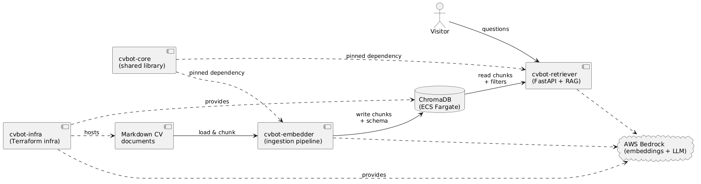

# cvbot-core

Shared Python library of the CVBot RAG system, consumed by cvbot-embedder and cvbot-retriever.

## Overview

CVBot is a personal RAG chatbot that answers questions about its owner's career from a small corpus of Markdown CV documents. It is deliberately a single-owner, low-volume system: semantic search over a few dozen chunks, re-ranked by metadata filters and recency, answered by a Bedrock LLM through a small web app.

**In scope:** private ingestion of local documents, retrieval-augmented question answering over them, minimal self-hostable cloud infrastructure.
**Out of scope:** general knowledge questions, multi-user accounts, document upload at runtime, model fine-tuning.

| Project | Role |
| --- | --- |
| **cvbot-core** | This library. The code both services must run identically: embeddings factory, ChromaDB connection, token counting, config parsing/validation, logging, backend protocols and the shared metadata vocabulary. Installed as a pinned dependency. |
| **cvbot-embedder** | Ingestion pipeline. Loads the Markdown documents, chunks them, parses `> key: value` section metadata into chunk metadata, embeds with Bedrock and (re)builds the ChromaDB collection, publishing the observed metadata schema on it. |
| **cvbot-retriever** | Retrieval and generation service. Condenses the question, extracts metadata filters, retrieves and re-ranks chunks, and generates the answer with a Bedrock LLM. Serves a small FastAPI web app with conversation history. |
| **cvbot-infra** | Terraform for the AWS side: ECS Fargate services for ChromaDB and the web app, API Gateway in front, service discovery, ECR and IAM. Everything private except the web app entry point. |



## cvbot-core

The package contains everything the two services must agree on, because ingestion and retrieval silently drift apart if they implement the same rules twice:

- `embeddings.py` / `vector_store.py` – the Bedrock embedding factory and the ChromaDB client, including the collection metadata keys (embedding model ID, metadata schema) that the embedder writes and the retriever reads back.
- `metadata.py` – the single definition of the section metadata vocabulary: key normalization, schema encode/decode, and the period rule (`startdate` / `enddate` → `period_end_year`) that the embedder derives the `years` and `iscurrent` fields from and the retriever rates recency against.
- `tokens.py` – `cl100k_base` token counting, shared by chunking and context budgeting.
- `env.py` / `validation.py` / `overrides.py` – typed environment reads, error-message-carrying validators and frozen-dataclass overrides behind each service's `Settings`.
- `protocols.py` – `EmbeddingModel`, `VectorStoreReader`, `VectorStoreWriter`: the services depend on these instead of concrete classes, which keeps the test doubles in `testing.py` (`FakeEmbeddings`) usable in both suites.
- `logging_config.py` – one log format for all entry points.

It exists so a rule change (a new metadata key, a different period rule, a token-count fix) lands once, is released as one tag, and both services move to it together.

## Setup

The library itself needs no setup to consume, but the release workflow (`.github/workflows/release.yml`) pushes tags back to GitHub and therefore needs write access:

1. The `tag` job requests `permissions: contents: write` and authenticates with a **GitHub App installation token** created by [`actions/create-github-app-token`](https://github.com/actions/create-github-app-token), not the default `GITHUB_TOKEN`.
2. Register a GitHub App, install it on this repository, and grant it the **Contents: Read and write** repository permission — that is what allows Git operations such as pushing a tag: [Choosing permissions for a GitHub App](https://docs.github.com/en/apps/creating-github-apps/registering-a-github-app/choosing-permissions-for-a-github-app), [Generating an installation access token](https://docs.github.com/en/apps/creating-github-apps/authenticating-with-a-github-app/generating-an-installation-access-token-for-a-github-app).
3. Store the app's credentials as repository secrets **`APP_ID`** (the app ID) and **`APP_PRIVATE_KEY`** (a generated app private key, PEM).

An App token is used instead of `GITHUB_TOKEN` so the tag push is a normal authenticated Git push.

## Usage

The package is not published to PyPI. Consumers pin the release tarball of an exact tag in `requirements.txt`, so embedder and retriever provably run against the same revision and no git client is needed at install time:

```
cvbot-core @ https://github.com/Fabian-Winter/cvbot-core/archive/refs/tags/v0.1.10.tar.gz
```

Then import the pieces needed, e.g.:

```python
from cvbot_core import build_bedrock_embeddings, configure_logging, count_tokens
```

To develop a service against an unreleased core change, install the checkout in editable mode instead of the pinned tag:

```bash
pip install -e ../cvbot-core
```

Development on the package itself: Python 3.13, `pip install -r requirements.txt`, tests with `pytest` (pure unit tests, no AWS calls — `cvbot_core.testing` provides the fakes).

## Releases

Releases are **tag-driven**: the git tag is the only version source.

- Every push to `main` runs the test suite; on a green run the workflow bumps the **patch** level of the latest `v*` tag and pushes the new annotated tag (`v0.1.10` → `v0.1.11`; the first release is `v0.1.0`).
- A commit that already carries a tag is skipped, so re-runs never create duplicates; a `concurrency` group keeps runs from overlapping.
- In git, consumers depend on tags directly via the archive URL above — a tag is an immutable pointer to an exact commit, which is what makes the pin reproducible.
- In Python, the `version` field in `pyproject.toml` stays a `0.0.0` placeholder and is never bumped: the identity of an installation comes from the pinned tag URL, not from the package metadata version. Higher-level releases (major/minor) are cut by pushing such a tag by hand when a change warrants it.
